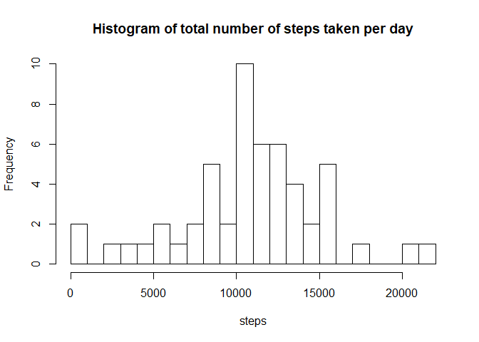
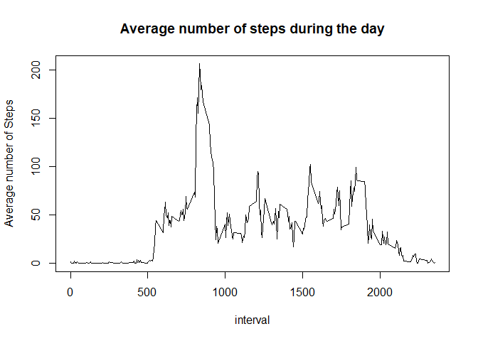
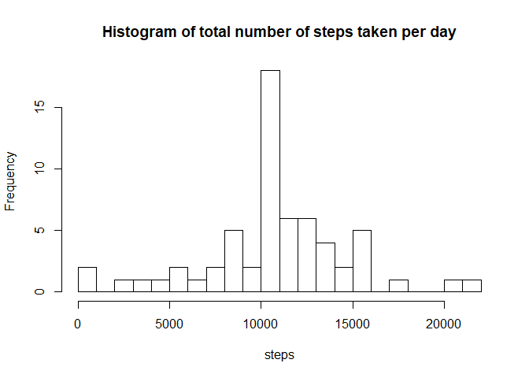
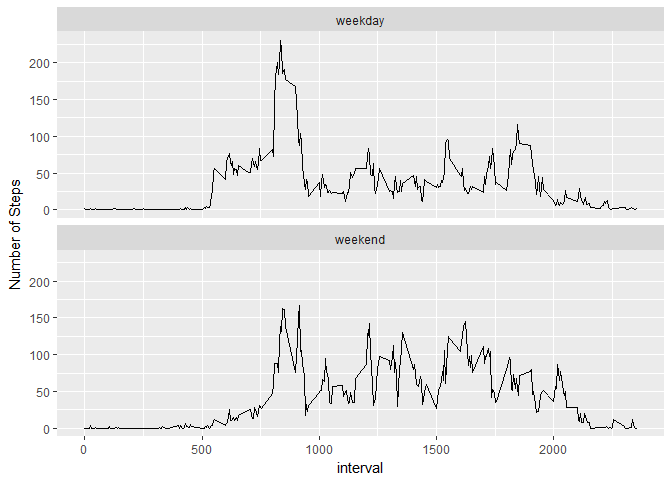

## Loading and preprocessing the data
### Loading librarys needed

```r
library(dplyr)
library(ggplot2)
```
### load and prepare the data

```r
fileUrl <- "https://d396qusza40orc.cloudfront.net/repdata%2Fdata%2Factivity.zip"
# download file if not already in Wd
if(!file.exists("repdata%2Fdata%2Factivity.zip"))
{
  download.file(fileUrl, "activity.zip")
}
# Unzip if necessary
if (!file.exists("activity.csv")) 
{ 
  unzip("activity.zip") 
}

activity <- read.csv("activity.csv")
activity$date <- as.Date(activity$date, "%Y-%m-%d")
head(activity)
```

```
##   steps       date interval
## 1    NA 2012-10-01        0
## 2    NA 2012-10-01        5
## 3    NA 2012-10-01       10
## 4    NA 2012-10-01       15
## 5    NA 2012-10-01       20
## 6    NA 2012-10-01       25
```


## What is mean total number of steps taken per day?
### First calculate the sums of steps per day

```r
sum_steps <- activity %>% filter(!is.na(steps)) %>% group_by(date) %>% 
    summarise(tot_steps = sum(steps))
```

```
## Warning: package 'bindrcpp' was built under R version 3.3.3
```

```r
arrange(sum_steps, desc(tot_steps))
```

```
## # A tibble: 53 x 2
##    date       tot_steps
##    <date>         <int>
##  1 2012-11-23     21194
##  2 2012-11-22     20427
##  3 2012-10-12     17382
##  4 2012-10-06     15420
##  5 2012-10-31     15414
##  6 2012-11-18     15110
##  7 2012-10-14     15098
##  8 2012-10-16     15084
##  9 2012-11-24     14478
## 10 2012-11-17     14339
## # ... with 43 more rows
```

### create histogram

```r
hist(sum_steps$tot_steps, breaks = 25, main = "Histogram of total number of steps taken per day", xlab = "steps")
```

<!-- -->

### calculate the mean

```r
mean_steps <- mean(sum_steps$tot_steps)
median_steps <- median(sum_steps$tot_steps)
```
mean = 1.0766189\times 10^{4}   
median = 10765

## What is the average daily activity pattern?
### First calculate the sums of steps per interval

```r
steps_interval <- activity %>% filter(!is.na(steps)) %>% group_by(interval) %>% 
    summarise(mean_steps_int = mean(steps))
arrange(steps_interval, desc(mean_steps_int))
```

```
## # A tibble: 288 x 2
##    interval mean_steps_int
##       <int>          <dbl>
##  1      835           206.
##  2      840           196.
##  3      850           183.
##  4      845           180.
##  5      830           177.
##  6      820           171.
##  7      855           167.
##  8      815           158.
##  9      825           155.
## 10      900           143.
## # ... with 278 more rows
```

### Time series plot of the 5-minute interval (x-axis) and the average number of steps taken, averaged across all days (y-axis)

```r
with(steps_interval, plot(interval, mean_steps_int, type = "l", xlab = "interval", 
                          ylab= "Average number of Steps", main = "Average number of steps during the day"))
```

<!-- -->

### Determine the 5-minute interval, on average across all the days in the dataset, which contains the maximum number of steps.

```r
max_interval <- steps_interval %>% filter(mean_steps_int == max(mean_steps_int)) %>% select(interval)
```
interval that contains the maximum number of steps on average = 835 

## Imputing missing values
### Calculate and report the total number of missing values

```r
sum_na <-sum(is.na(activity$steps))
```
total number of missing values = 2304 

### Impute missing values with the mean for each interval

```r
activity_nw <- activity
activity_nw$steps[is.na(activity_nw$steps)] <- tapply(activity_nw$steps, activity_nw$interval, mean, na.rm=TRUE, simplify=T)
```

### make histogram and calculate the mean and median per day

```r
sum_steps_nw <- activity_nw %>% filter(!is.na(steps)) %>% group_by(date) %>% 
    summarise(tot_steps = sum(steps))
hist(sum_steps_nw$tot_steps, breaks = 25, main = "Histogram of total number of steps taken per day", xlab = "steps")
```

<!-- -->

### calculate the mean

```r
mean_steps_nw <- mean(sum_steps_nw$tot_steps)
median_steps_nw <- median(sum_steps_nw$tot_steps)
```
mean = 1.0766189\times 10^{4}   
median = 1.0766189\times 10^{4}  
imputing data has no effect on the mean and a small change in median (is equal to mean now)

## Are there differences in activity patterns between weekdays and weekends?

```r
activity_nw <- mutate(activity_nw, 
                      wd_ind = as.factor(case_when(weekdays(activity_nw$date) == "Sunday" |
                                                   weekdays(activity_nw$date) == "Saturday" ~ "weekend"
                                                   , TRUE ~ "weekday")))
steps_interval_nw <- activity_nw %>% group_by(interval, wd_ind) %>% 
    summarise(mean_steps_int = mean(steps))

g <- ggplot(steps_interval_nw, aes(interval, mean_steps_int))
g + geom_line() + facet_wrap(~ wd_ind, nrow = 2, ncol = 1) + labs(y="Number of Steps")
```

<!-- -->
